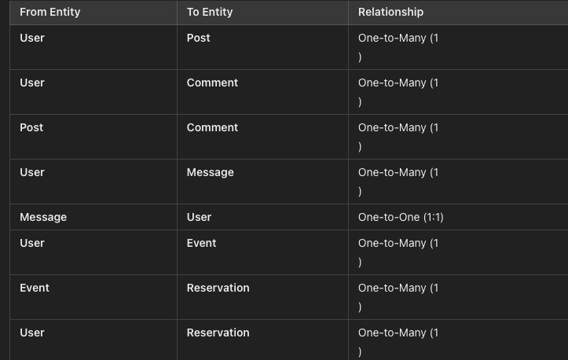

# Street Seeker App (Barcelona Edition)

### Your Ultimate Guide to Unforgettable Experiences!

___

Street Seeker is an app that will help users to find ideal plans, events, places to go around the city, this time as an preview of the full project I have in mind I did BARCELONA EDITION! Showing the most relevant places of the city and letting the user book or reserve through the app.

It is a fullstack app site that allows users to check on diferent random places, create an account and comment and review their plans.

Link to live site - [https://streetseeker-e20ed2f178d7.herokuapp.com/](https://streetseeker-e20ed2f178d7.herokuapp.com/)

## Site Objectives

Design and create a site that allows users to search for and book random places, demonstrating an increasing understanding of the libraries and frameworks available to developers.

Main objectives were:

- ### Develop an intuitive, attractive, and mobile-friendly front end

The goal was to make the site easily accessible and intuitively navigated for the users. To achieve this, Django and Bootstrap were used to create and style the front end. The design ensures that users can seamlessly search for places, view details, and make bookings.

- ### Make use backend functionality

  Django’s powerful backend framework, the site allows users to create profiles, book reservations, view and manage their bookings, and comment on their experiences. This functionality provides a dynamic and interactive user experience, ensuring that users can easily engage with the content.

- ### Store data on an external cloud database

 For data storage, ElephantSQL was used to host the PostgreSQL database. This setup ensures reliable and scalable data management, allowing the application to handle user data, bookings, and comments efficiently.
 
 # User Experience/UX

## Target Audience

- Individuals interested in exploring hidden gems, discovering random places, and sharing their travel experiences.

## User Stories

### New Visitor Goals

- Quickly grasp the purpose and functionality of the site.
- Easily navigate through the site.
- Create an account to start booking places and engage with other users.

### Existing Visitor Goals

- Log in and out of their accounts.
- Browse available places and view details about each location.
- Make reservations, manage their bookings, and share feedback on places they’ve visited to connect with other travelers.

# Design Choices

## Colour Scheme

The color scheme for the "Street Seeker" app is inspired by natural tones, reflecting the adventurous and exploratory nature of the app. Subtle, neutral colors are used predominantly, with vibrant accents for actionable elements like buttons and links to ensure they stand out for ease of navigation and interaction.

## Typography

The primary font used across the site is Verdana, chosen for its readability and clean look. For the main logo text on the navbar, Tangerine is used to add a touch of elegance and distinctiveness. (Subject that could be changed in the future).

## Logo and Favicon

The logo and favicon are designed to capture the essence of exploration and discovery, featuring an icon that represents a compass or map marker, aligning with the theme of finding and booking unique places.

## Wireframes

- Desktop Homepage Wireframe

- Desktop Search Wireframe

- Desktop Others Wireframe

## Database Plan

The database plan for the "Street Seeker" app is straightforward, capturing essential information about users, places, reservations, and comments. It outlines the type of data stored and indicates whether a field is a Primary or Foreign key where applicable.

# Features

## Registration

- Users can create an account to access the app's full features.

## View Random Places on Home Page
- Users can see a selection of random places directly on the home page.

## Browse by Place Category
- Users can browse places based on different categories.

## Comment on Places
- Users can leave comments on places they've visited. They also have the option to delete their own comments if they wish.

## Future Features

- View a map and better description of the diferent places while the booking
- Depending on users likes provide, more accurate places or events.
- Live chat for growing the community in where users can see whats happening in real life in the city
- A blog where we can provide info and news of what is going on
- Add an option for users to edit comments
- Add profile page for users to add profile image and edit personal details
- Add an option for users to upload photos into the comments

# Technologies Used

- [Gitpod](https://gitpod.com/) The IDE used to build and develop this project.
- [Github](https://github.com) To host and store the data for the site.
- [PEP8 Validator](https://pep8ci.herokuapp.com/) Used to check python code for errors
- [ElephandSQL](https://www.elephantsql.com/) Used to store PostgreSQL database.
- [Cloudinary](https://cloudinary.com/) Used as cloud storage for images uploaded as part of the blog posts
- [Heroku](https://id.heroku.com/) Used to deploy the project

# Programming Languages, Frameworks and Libraries Used

- [HTML](https://developer.mozilla.org/en-US/docs/Web/HTML)
- [CSS](https://developer.mozilla.org/en-US/docs/Learn/Getting_started_with_the_web/CSS_basics)
- [Python](https://en.wikipedia.org/wiki/Python_(programming_language))
- [Django](https://www.djangoproject.com/)
- [Bootstrap](https://getbootstrap.com/)

# Agile

This project was designed using Agile methodology, utilising the Project Board and Issues sections in GitHub

- [Project Board](https://github.com/users/Juandavidc08/projects/6)

# Testing

Throughout the development of this project, each section, function, and model was rigorously tested to ensure proper functionality and styling. Issues identified during testing were promptly corrected before proceeding to the next stage.

## Testing Methodology
### Incremental Testing:

- As new features and models were built, they were tested individually for both functionality and styling. Any issues encountered were addressed immediately.

### User Testing:
- Friends and colleagues were invited to test the site by signing up, booking places, adding comments, and deleting comments.
Testing was conducted across various devices and platforms, including iOS and Android, as well as mobile phones and tablets, to ensure cross-platform compatibility.
Testers reported back any issues with functionality or styling, which were then resolved.

### Continuous Feedback Loop:

- A feedback loop was established to ensure that all reported issues were documented and addressed in a timely manner.
This approach ensured a robust and user-friendly application, capable of providing a seamless experience across different devices and operating systems.

## The table below summarizes the issues identified during testing and the corresponding fixes implemented:

| Issue Description	| Testing Phase	| Device/Platform	| Resolution|
|:---:|:---:|:---:|
| Styling issue with navigation bar	| Incremental	| All |	Adjusted CSS for consistency| 
| Login functionality not working	| User Testing	| iOS, Android	| Fixed authentication logic|
| Comment deletion not reflecting	| User Testing	|Mobile, Tablet	| Updated comment deletion flow|
| Images not displaying properly	| Incremental	| All	| Fixed image URLs and Cloudinary|

## Manual Testing

- ADMIN
| TEST	| OUTCOME| 	PASS/FAIL| 
|:---:|:---:|:---:|
| Create Place	| Place successfully created and displayed| 	Pass| 
|  Edit Place	| Error thrown when editing place details (*)	| FAIL| 
| Edit Place (after fix)| 	Place details updated successfully	| Pass| 
| Delete User Comments| 	Comment deleted successfully| 	Pass| 
| Delete Place| 	Place deleted successfully| 	Pass| 
| Create 4 Test Places to check Pagination| 	Next/Previous Page appears at the bottom of the screen| 	Pass|

| TEST| 	OUTCOME| 	PASS/FAIL| 
|:---:|:---:|:---:|
| Create Account| 	Account created successfully| 	Pass| 
| Error Check - Error page when signing up with email address| 	Unable to replicate the error (*)| 	Closed| 
| Login| 	Login successful| 	Pass| 
| Logout| 	Logout successful| 	Pass| 
| Read Full Place Details| 	PlaceDetail page loaded successfully| 	Pass| 
| Add Comment under Place| 	Comment added successfully| 	Pass| 
| Delete Comment| 	Comment deleted successfully| 	Pass| 
| Create User Account to Check Access to Restricted Pages | 	Page displayed correct error message, with no access to restricted content| 	Pass| 

## Bugs

### Database Connection Issue
- At one point during development, I encountered a problem with the database connection. The issue stemmed from a misconfiguration in the database settings, which prevented the application from connecting properly to the database. To resolve this, I:
-Verified the database connection settings in the Django configuration.
- Reconfigured the database URL and credentials to ensure proper connectivity.
- Conducted tests to confirm that the application could successfully interact with the database.

### Cloudinary Image Upload Problem
- There was a challenge with uploading images to Cloudinary Images were not being sent to Cloudinary for cloud storage, resulting in missing visual content. This issue was resolved by:
- Ensuring that Cloudinary settings were correctly configured in the Django application to handle file uploads.

### Heroku Database Connectivity Issue
- Towards the end of the project, a problem emerged with the database connection on Heroku. The app was unable to communicate with the PostgreSQL database hosted on Heroku, leading to errors in data retrieval and storage. To address this issue, I:

- Updated the database configuration in the Django settings to match the Heroku PostgreSQL database credentials.
- Verified the database connection using Heroku’s CLI tools and checked for any configuration discrepancies.
- Re-deployed the application to Heroku after making the necessary adjustments to ensure stable connectivity.

## Lighthouse

## Validation Testing

### HTML & CSS

HTML testing was completed using [W3 Validator](https://validator.w3.org/)

CSS testing was completed using [W3 Validator](https://jigsaw.w3.org/css-validator/)

## Python Testing

Python pep8 validation was done via [Code Institute's Python Linter](https://pep8ci.herokuapp.com/)

The only errors recieved here were where some lines of text exceeded the limit of 79 characters

### Github Deployment

- The source code for this website was managed and version-controlled using GitHub. Here’s a summary of the deployment process:

- To ensure that all changes are properly tracked and updated in your GitHub repository, follow these steps:

- Stage Changes:

- Open your terminal within your IDE.
- Run the command: git add . to stage all modified files for commit.

- Commit Changes:

- Next, create a commit with a descriptive message using: git commit -m "commit message".
- This command captures a snapshot of your changes and adds it to your local Git history.

- Push Changes:

- Finally, push your commits to the remote repository on GitHub by running: git push.
- This updates your GitHub repository with the latest code changes, making them available online.
- These steps ensure that your codebase remains synchronized with the GitHub repository, providing a reliable version control system for your project.

### Repository deployment via Heroku

- To deploy your project to Heroku, follow these steps:

- Create a New App:

- Navigate to the Heroku Dashboard.
- Click on New and select Create New App from the dropdown menu.

- Configure Your App:

- On the subsequent page, enter your desired App name and select a Region.
- Click Create app to proceed with the setup.

- Set Configuration Variables:

- Go to the Settings tab of your app and click Reveal Config Vars.
- Add the following configuration variables:
- Additional credentials required for this app:
- Cloudinary URL
- PostgreSQL Database URL

- Add Buildpacks:

- Still in the Settings tab, click Add buildpack.
- First, select Python as the buildpack.
- Then, add Node.js as the second buildpack.

- This process sets up your Heroku environment with the necessary configurations and buildpacks, enabling your application to deploy and run smoothly.

### Deployment of the app

- To deploy your app on Heroku, follow these steps:

- Connect to GitHub:

- Navigate to the Deploy tab in your Heroku app dashboard.
- Click on GitHub under Deployment method and select Connect to GitHub.

- Link Your Repository:

- Enter the name of your GitHub repository in the search field and click Search.
- Select the correct repository from the search results and click Connect to link it to your Heroku app.

- Choose Deployment Method:

- You can choose between Manual or Automatic deployment:
- Manual Deployment: Deploy your app by clicking Deploy Branch whenever you push changes to GitHub.
- Automatic Deployment: Automatically deploy your app whenever you push changes to the selected branch on GitHub.

- Deploy and Launch:

- Once the deployment method is selected, Heroku will build and deploy your app.
- After the build process completes, click the Open app button, which appears below the build information window, to view your live app.
- Alternatively, you can find another Open app button in the top right corner of the page.
- These steps ensure that your app is connected to GitHub and can be deployed and accessed via Heroku.

## Credits

This project is built upon the foundational framework provided by Code Institute's "I Think Therefore I Blog" walkthrough module. The initial blog template served as a base, which was extensively customized using Bootstrap and custom CSS to meet the specific requirements of this application.

Alot of credits to CODEMY for their incredible explanations on their tutorias of django in youtube , the best of all its free and I did learn so much many concepts I did have miss before [@Codemycom](https://www.youtube.com/watch?v=cb1Pr8-m5YE&t=36)

Also from youtube to [@TechWithTim] one of my favorites youtubers of all, with these videos he simplified what sometimes is give to you as if it was impossible (https://www.youtube.com/watch?v=nGIg40xs9e4&t=799s)

The Readme layout was based on the example by [markdaniel1982](https://github.com/markdaniel1982/MD82-P4/blob/main/README.md?plain=1) it was an amazing read me thanks alot.

## Images 

- Background, Comments and book images from [freepik ](https://www.freepik.com/)
- Most of the places images are taken from [Tripadvisor] (http://www.tripadvisor.com/)
- Thanks to all the community of [Tripadvisor] who shared, this images are for school purpose so when the app is set for real use, i'll change them, Im completly greatfull.

## Acknowledgments and Thanks

- Sarah and Roo at Code Institute's tutor support for the help. 

- John Elder [Codemy](https://www.youtube.com/@Codemycom) 

- Tech with tim [@TechWithTim] (https://www.youtube.com/@Techwithtim) 